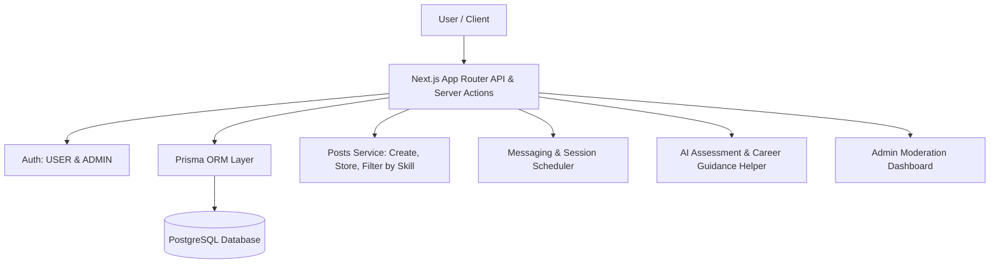
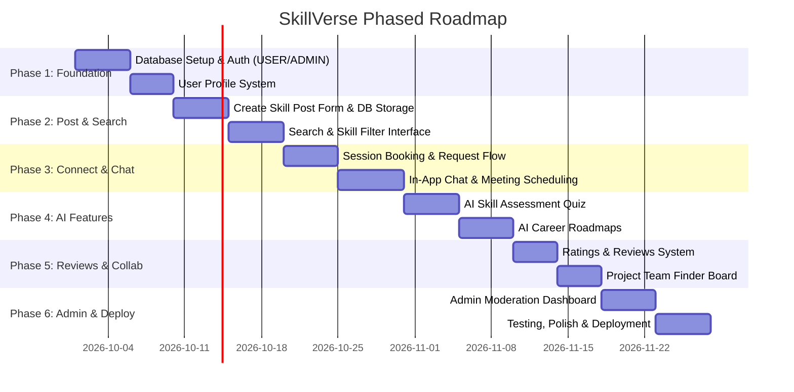

# SkillVerse — Project Specification & Implementation Plan

> **Academic Context:** Sreepathy Institute of Management & Technology, Department of Computer Science & Engineering
> **Course:** CSD 415 Project Phase 1
> **Project Title:** Peer-to-Peer Skill Sharing & Mentorship Platform (**SkillVerse**)
> **Target Stack:** Next.js 16 (App Router), React 19, TypeScript, Tailwind CSS v4, PostgreSQL, Prisma ORM, Zod, LLM API

---

## 1. Executive Summary & Core Workflow

**SkillVerse** is a straightforward, direct peer-to-peer (P2P) skill-sharing and learning platform where users connect by posting and searching skill offers.

### Simple Core Flow:

```
┌───────────────────────────────┐
│          CREATE POST          │
│   (Skill + Title + Details)   │
└───────────────┬───────────────┘
                │
                ▼
┌───────────────────────────────┐
│      STORED IN DATABASE       │
└───────────────┬───────────────┘
                │
                ▼
┌───────────────────────────────┐
│        SEARCH & FILTER        │
│   (Filter posts by skill)     │
└───────────────┬───────────────┘
                │
                ▼
┌───────────────────────────────┐
│        DISPLAY RESULTS        │
│ (Seeker picks post & connects)│
└───────────────────────────────┘
```

---

## 2. Scope Boundaries

```JavaScript
┌─────────────────────────────────────────────────────────┐
│                    SKILLVERSE SCOPE                     │
├────────────────────────────┬────────────────────────────┤
│       INCLUDED IN SCOPE    │   OUTSIDE CURRENT SCOPE    │
├────────────────────────────┼────────────────────────────┤
│ • 2 Roles: USER & ADMIN    │ • Weighted Matching Formula│
│ • Create Skill Offer Post  │ • AI-Based Matching        │
│ • Database Storage (Prisma)│ • Complex Compatibility    │
│ • Search by Skill Name/Tag │ • Skill Coins / Tokens     │
│ • Display Filtered Results │ • XP, Badges, Leaderboards │
│ • Direct Connect / Booking │ • Corporate / Company Role │
│ • In-App Chat & Scheduling │ • Full-Scale HR Management │
│ • Simple AI Skill Test     │ • University Exam Portals  │
│ • Simple AI Career Guide   │ • Complex Banking Systems  │
│ • Ratings & Review System  │                            │
│ • Admin Post Moderation    │                            │
└────────────────────────────┴────────────────────────────┘
```

---

## 3. System Architecture & Modules



### Core Functional Modules

| Module ID     | Module Name                             | Description                                                                                          |
| ------------- | --------------------------------------- | ---------------------------------------------------------------------------------------------------- |
| **M01** | **Authentication & Roles**        | Email/Password & OAuth login with`USER` and `ADMIN` roles.                                       |
| **M02** | **Profile Management**            | User profile with bio, contact links, and learning interests.                                        |
| **M03** | **Create Skill Post**             | Form to submit a post:**Skill + Title + Description + Pricing (Free/Paid) + Available Times**. |
| **M04** | **Search & Filter Posts**         | Direct search engine to query and filter posts by**Skill Name**, category, and type.           |
| **M05** | **Post Details & Direct Connect** | Seeker views post details, poster profile, and sends a session/connection request.                   |
| **M06** | **Chat & Session Scheduling**     | Direct 1-on-1 text messaging and calendar meeting link sharing.                                      |
| **M07** | **AI Skill Assessment**           | Simple AI quiz generator & answer evaluation to verify skill level.                                  |
| **M08** | **AI Career Guidance**            | Simple AI assistant providing personalized learning roadmaps based on user goals.                    |
| **M09** | **Ratings & Reviews**             | Post-session 1–5 star rating and written feedback.                                                  |
| **M10** | **Project Team Finder**           | Simple board where users post collaboration requests for projects.                                   |
| **M11** | **Admin Moderation**              | Admin panel to review, edit, or delete posts and manage users.                                       |

---

## 4. Phased Implementation Roadmap



---

### Phase 1: Database Setup, Authentication & Profiles

* **Step 1.1 — Database Setup:** PostgreSQL database with Prisma schema.
* **Step 1.2 — Authentication & RBAC:** User signup/login with roles: `USER` (default) and `ADMIN`.
* **Step 1.3 — Profile Setup:** User profile with basic bio, timezone, and social/portfolio links.

---

### Phase 2: Create Post, Database Storage & Skill Search Filter

* **Step 2.1 — Create Post Flow:**
  * User fills a simple form:
    * **Skill Name:** (e.g., *React, Python, Figma, DSA*)
    * **Post Title:** (e.g., *“Beginner Friendly Python Tutoring”*)
    * **Description:** (what will be taught, experience level, requirements)
    * **Price:** *Free* or *Paid* (with rate)
    * **Availability:** Available days/hours
  * Submits $\rightarrow$ Stored in PostgreSQL `Post` table.
* **Step 2.2 — Search & Filter Flow:**
  * Search bar on explore page.
  * Direct query by skill name (e.g., search `"Python"` returns all posts where `skill = "Python"`).
  * Filter by category (e.g., Web Dev, Mobile, Design, AI) and pricing (Free / Paid).
* **Step 2.3 — Display Results:**
  * Responsive card grid displaying post title, skill badge, creator name, rating, price, and "Connect" button.

---

### Phase 3: Session Requests, In-App Chat & Scheduling

* **Step 3.1 — Session Request Flow:**
  * Seeker views post $\rightarrow$ Clicks "Request Session" $\rightarrow$ Creator accepts/declines.
* **Step 3.2 — Direct Messaging & Meeting Links:**
  * In-app 1-on-1 chat for conversation.
  * Meeting scheduler to attach Google Meet / video call links.

---

### Phase 4: AI Skill Assessment & AI Career Guidance

* **Step 4.1 — AI Skill Assessment:**
  * AI generates a simple 5-question quiz for any chosen skill.
  * Evaluates score and awards an "AI-Verified" tag to user's profile.
* **Step 4.2 — AI Career Guidance:**
  * User enters career goal $\rightarrow$ AI recommends key skills to learn and search for on SkillVerse.

---

### Phase 5: Reviews, Ratings & Project Team Finder

* **Step 5.1 — Reviews & Ratings:**
  * 1 to 5 star rating + review comment after a completed session.
* **Step 5.2 — Project Team Finder:**
  * Simple bulletin board to post project collaboration ideas and invite peers.

---

### Phase 6: Admin Dashboard, Testing & Deployment

* **Step 6.1 — Admin Moderation Dashboard:**
  * Manage and delete spam/inappropriate posts.
  * Manage users and view platform statistics.
* **Step 6.2 — Testing & Deployment:**
  * End-to-end testing, responsive design polish, and deployment on Vercel with PostgreSQL.

---

## 5. Prisma Database Schema Blueprint

```prisma
datasource db {
  provider = "postgresql"
  url      = env("DATABASE_URL")
}

generator client {
  provider = "prisma-client-js"
}

enum Role {
  USER
  ADMIN
}

enum PricingType {
  FREE
  PAID
}

enum PostStatus {
  ACTIVE
  PAUSED
  REMOVED
}

enum BookingStatus {
  PENDING
  ACCEPTED
  COMPLETED
  CANCELLED
}

model User {
  id            String    @id @default(cuid())
  name          String
  email         String    @unique
  passwordHash  String?
  image         String?
  role          Role      @default(USER)
  createdAt     DateTime  @default(now())
  updatedAt     DateTime  @updatedAt

  profile       Profile?
  posts         Post[]            @relation("UserPosts")
  sentBookings  Booking[]         @relation("SeekerBookings")
  recvBookings  Booking[]         @relation("ProviderBookings")
  reviewsGiven  Review[]          @relation("ReviewsGiven")
  reviewsRecv   Review[]          @relation("ReviewsRecv")
  assessments   SkillAssessment[]
  projectPosts  ProjectPost[]
}

model Profile {
  id          String   @id @default(cuid())
  userId      String   @unique
  user        User     @relation(fields: [userId], references: [id], onDelete: Cascade)
  headline    String?
  bio         String?
  timezone    String   @default("UTC")
  githubUrl   String?
  linkedinUrl String?
}

// Simple Skill Offer Post
model Post {
  id          String      @id @default(cuid())
  userId      String
  user        User        @relation("UserPosts", fields: [userId], references: [id], onDelete: Cascade)
  skillName   String      // e.g. "Python", "React", "UI Design"
  category    String      // e.g. "Programming", "Design", "Data Science"
  title       String      // e.g. "Learn Python DSA from scratch"
  description String      // Detailed information on what is offered
  pricingType PricingType @default(FREE)
  priceAmount Float?      // Price if PAID
  availability String?    // e.g. "Weekends 6 PM - 9 PM"
  status      PostStatus  @default(ACTIVE)
  createdAt   DateTime    @default(now())
  updatedAt   DateTime    @updatedAt
  bookings    Booking[]
}

model Booking {
  id          String        @id @default(cuid())
  postId      String
  post        Post          @relation(fields: [postId], references: [id], onDelete: Cascade)
  seekerId    String
  providerId  String
  seeker      User          @relation("SeekerBookings", fields: [seekerId], references: [id])
  provider    User          @relation("ProviderBookings", fields: [providerId], references: [id])
  status      BookingStatus @default(PENDING)
  scheduledAt DateTime?
  meetingUrl  String?
  createdAt   DateTime      @default(now())
  reviews     Review[]
}

model Review {
  id        String   @id @default(cuid())
  bookingId String
  booking   Booking  @relation(fields: [bookingId], references: [id], onDelete: Cascade)
  authorId  String
  targetId  String
  author    User     @relation("ReviewsGiven", fields: [authorId], references: [id])
  target    User     @relation("ReviewsRecv", fields: [targetId], references: [id])
  rating    Int      // 1 to 5
  comment   String
  createdAt DateTime @default(now())
}

model SkillAssessment {
  id            String   @id @default(cuid())
  userId        String
  user          User     @relation(fields: [userId], references: [id], onDelete: Cascade)
  skillName     String
  score         Float
  isVerified    Boolean  @default(false)
  feedback      String
  createdAt     DateTime @default(now())
}

model ProjectPost {
  id          String   @id @default(cuid())
  userId      String
  user        User     @relation(fields: [userId], references: [id], onDelete: Cascade)
  title       String
  description String
  skillsNeeded String[]
  contactInfo String
  createdAt   DateTime @default(now())
}
```

---

## 6. Verification & Deliverables Checklist

- [ ] **Phase 1:** Auth (`USER` & `ADMIN`) and Profile setup
- [ ] **Phase 2:** Create Skill Post Form, PostgreSQL storage, Search & Filter by Skill Name
- [ ] **Phase 3:** Booking session request flow, In-app chat & meeting link sharing
- [ ] **Phase 4:** AI Skill Quiz assessment and AI Career Guidance roadmap generator
- [ ] **Phase 5:** 1–5 star reviews & Project team collaboration board
- [ ] **Phase 6:** Admin moderation portal, end-to-end testing, and deployment
